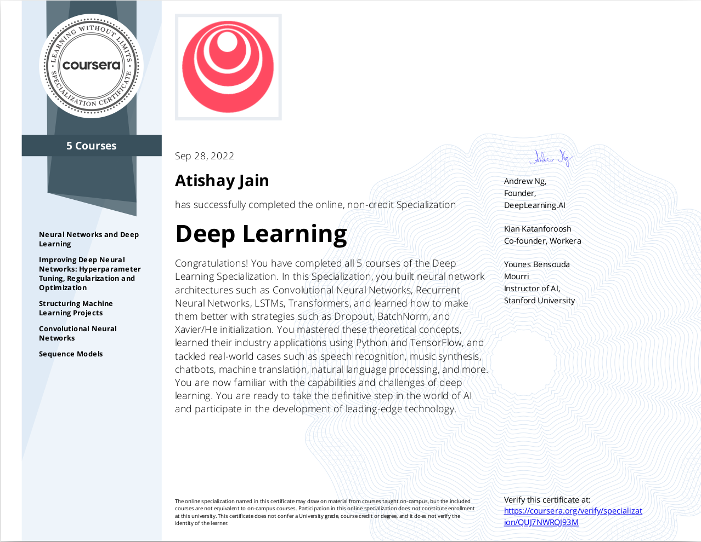
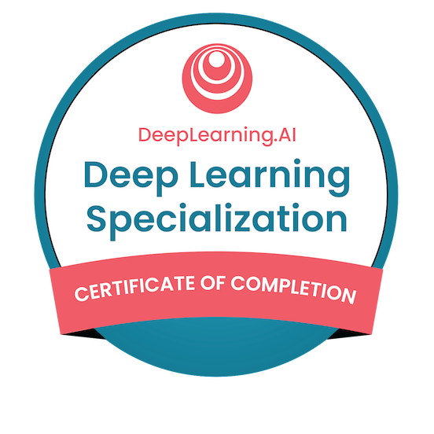

### Neural Networks and Deep Learning
* Certificate Link: https://coursera.org/share/72271c0e2d4e5fac786fbd1c863adf84
* Certificate 📷:
 

------------

### Improving Deep Neural Networks: Hyperparameter tuning, Regularization and Optimization
* Certificate Link: https://coursera.org/share/9a3563de3966f953a0071b007ce9cc23
* Certificate 📷:
 

------------

### Structuring Machine Learning Projects
* Certificate Link: https://coursera.org/share/481b3a6a10404a23f6df1fa41281d502
* Certificate 📷:
 

------------

### Convolutional Neural Networks
* Certificate Link: https://coursera.org/share/10a5cc851674221a03f7ccc74fe112f1
* Certificate 📷:
 

------------

### Sequence Models
* Certificate Link: https://coursera.org/share/37a68979a802d482741e29c5b8fc4f77
* Certificate 📷:
 

------------

### Specialization Completion Certificate
* Certificate Link: https://coursera.org/share/e8cb87682e69cb79c5fa1926fe09ac16
* Certificate 📷:

------------

### Specialization Completion Badge
* Badge URL: https://www.credly.com/badges/b7a25557-9e76-4505-b147-2c12daba6537/public_url
* Badge 📷:

